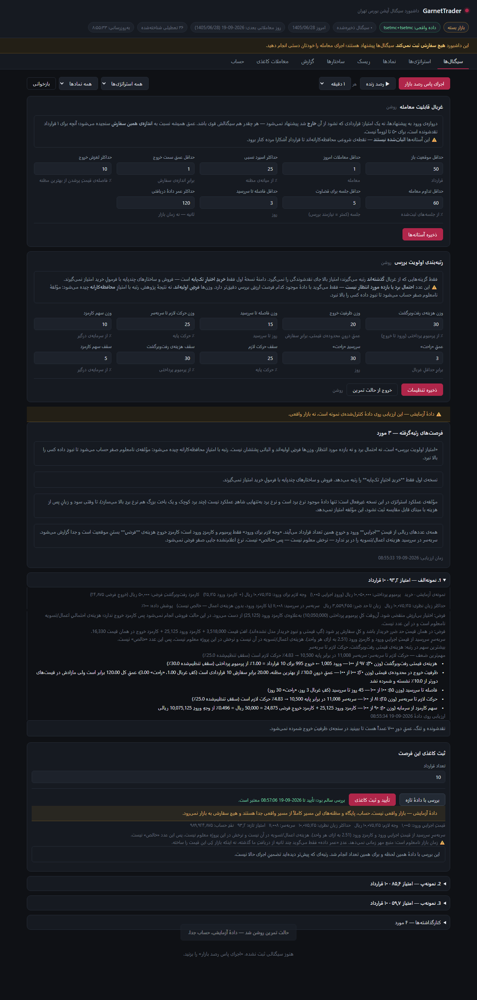
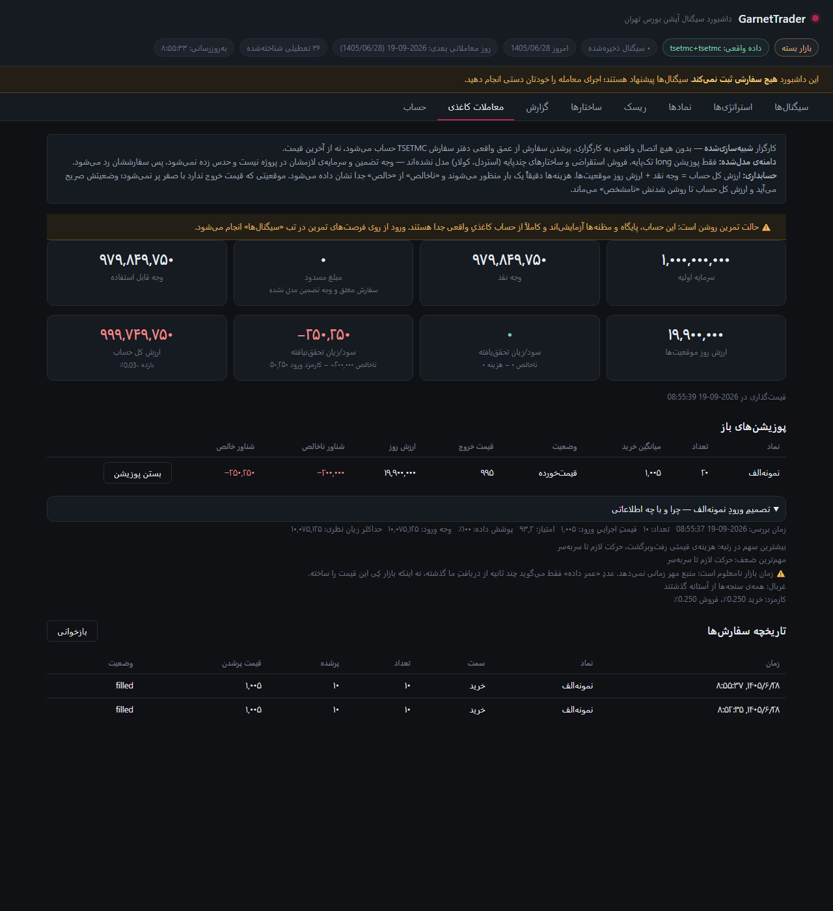
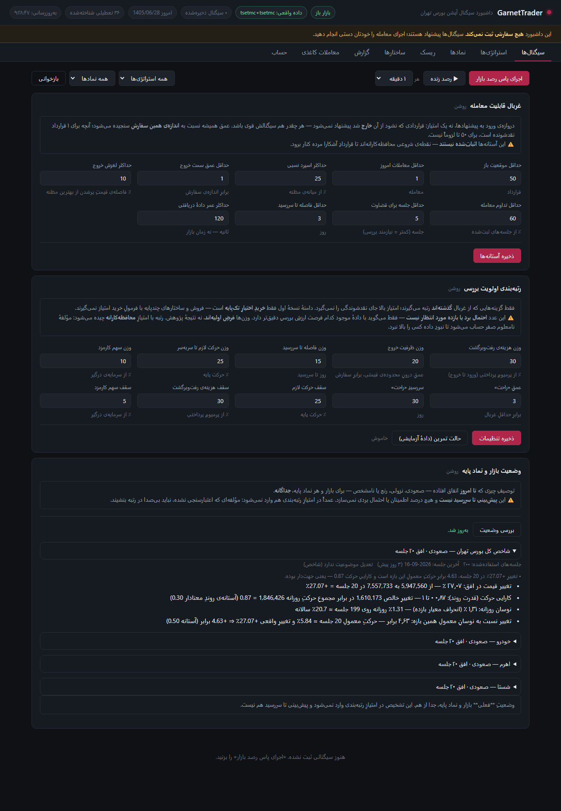

# رابط، در سه تصویر

عکس‌ها از اجرای واقعیِ همین کد در **۲۰۲۶-۰۹-۱۹** گرفته شده‌اند (بازار
باز). دستورِ اجرا و سناریوی پنج‌دقیقه‌ای در
[`option_signal_bot/README.md`](../option_signal_bot/README.md) است.

---

## ۱. فرصت، دلیلش، و بررسی با دادهٔ تازه

کارتِ هر فرصت می‌گوید **چرا** این رتبه را گرفته: سهمِ هر مؤلفه، ضعفِ
اصلی، و آنچه نامعلوم مانده. زیرش، جریانِ ورود:

* تعداد را خودتان انتخاب می‌کنید؛
* «بررسی با دادهٔ تازه» همه‌چیز را برای **همان تعداد** و با دادهٔ همان
  لحظه دوباره حساب می‌کند — قیمتِ اجراییِ ورود، وجهِ لازم، حداکثر زیان،
  سر‌به‌سر و **امتیازِ تازه**؛
* «تأیید و ثبت کاغذی» فقط تا عمرِ همان بررسی معتبر است. تعداد را عوض
  کنید، خودش باطل می‌شود.

تصویر در **حالت تمرین** است (برچسبِ زردِ بالای فهرست)؛ مسیر واقعی
همین شکل است با دادهٔ بازار.

---

## ۲. موقعیت، و «آن موقع چه می‌دانستم؟»

حساب، موقعیتِ باز، ارزش روز و سود/زیانِ شناور — و کشویی که **عکسِ
ارزیابیِ لحظه‌ی تصمیم** را نگه داشته: امتیاز، پوشش داده، وجهِ ورود،
حداکثر زیان، نقاط قوت و ضعف و نامعلوم‌ها. بدون این، ارزیابیِ بعدیِ
معامله روی حدس بنا می‌شد.

---

## ۳. وضعیت بازار و نماد پایه

بازار و هر نماد پایه **جداگانه**: صعودی، نزولی، رنج یا نامشخص — با
قدرتِ روند، نوسان، افق، تازگیِ داده، وضعیتِ تعدیل و دلیلِ حکم.

این توصیفِ وضعیتِ **فعلی** است، نه پیش‌بینی تا سررسید، و عمداً در
امتیازِ رتبه‌بندی وارد نمی‌شود.
